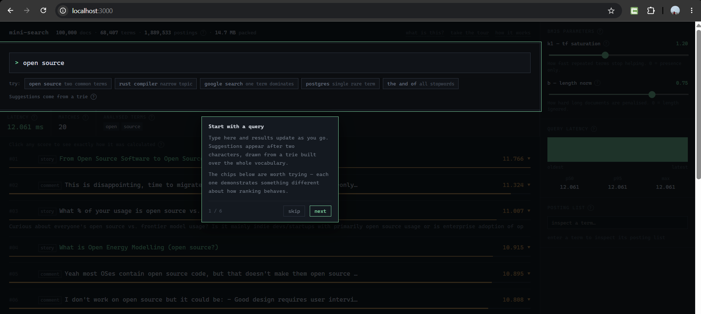

# mini-search

A search engine built from scratch in TypeScript. No Elasticsearch, no Lucene,
no search libraries — the tokenizer, stemmer, inverted index, BM25 ranking,
phrase matching and trie autocomplete are all hand-written.

It indexes **100,000 Hacker News stories and comments** and answers queries in
about half a millisecond.



> Live demo: _coming soon_ · [How it works](public/how.html)

---

## What it does

- **Ranked full-text search** over 100k documents using BM25
- **Phrase queries** — `"machine learning"` matches only where those words are adjacent
- **Autocomplete** from a trie over the 68k-term vocabulary
- **A UI that shows its own internals** — click any score to see the exact
  arithmetic behind it, drag sliders to change the ranking formula live, and
  inspect any term's raw posting list

The interface isn't a demo wrapper. It's built to make the algorithm visible:
every ranking decision can be expanded into the numbers that produced it.

---

## Try it

```bash
npm install
npm run corpus   # fetch 100k docs from the HN API (~1 min)
npm run dev      # build the index and serve on :3000
```

Then open http://localhost:3000.

Worth trying once you're in:

- Search `open source`, then click a score to open the breakdown
- Drag the **b** slider to 0 and watch long comments climb the results
- Search `"open source"` **with quotes** and compare — far fewer results
- Type `a` in the autocomplete and note it's as fast as a long prefix

---

## How it works

**The index.** Normally a document points to its words. An inverted index flips
that — each word points to the documents containing it, like the index at the
back of a textbook. Without it, every query means reading all 100,000 documents.

**Analysis.** Text is lowercased, stripped of HTML, split on punctuation,
filtered for stopwords, and stemmed before indexing. Queries go through the
*identical* pipeline. If the two ever diverge, search silently returns nothing —
so both paths call one shared `analyze()` function.

**Ranking.** BM25 balances three signals: how rare a word is, how often it
appears in a document (with diminishing returns), and how long the document is.
It's about thirty years old and still the default in Elasticsearch today.

**Phrases.** Each posting stores the positions where its term appears. Matching
`"machine learning"` means finding documents where `learning` sits exactly one
position after `machine`. Positions are numbered *before* stopword removal —
otherwise "machine is learning" would look adjacent once `is` was dropped, and
falsely match.

There's a longer writeup with diagrams in [`public/how.html`](public/how.html).

---

## Every score is inspectable

Click the orange number on any result and it expands into the arithmetic that
produced it — each term's rarity, its frequency in that document, the length
penalty, and what it contributed. The contributions sum exactly to the total.

<!-- TODO: docs/explain.png — a result with its score breakdown expanded -->

---

## Performance work

Three optimisations, each measured before and after, each with a test proving
the behaviour didn't change.

### 1. Objects → flat typed arrays

The obvious representation is `Map<string, {docId, termFreq}[]>`. It cost
**181 MB** for 1.9M postings — about 96 bytes each to hold two integers that
need eight. Every posting was a separately allocated heap object, so iterating a
list meant chasing pointers all over the heap.

Packing them into parallel `Uint32Array`s made each posting list a contiguous
slice.

### 2. Score `Map` → dense accumulator

Packing only bought 25% on latency, well short of what the memory win suggested.
Profiling showed the bottleneck had moved: scoring accumulated into a
`Map<docId, score>`, which meant a hash operation per posting — 11,600 of them
for a common term.

Replacing it with a `Float64Array` indexed by docId, plus a list of touched ids
so the reset costs the same as the scoring did, removed that entirely.

| | p50 | p99 | throughput | memory |
|---|---|---|---|---|
| objects + Map | 0.901 ms | 10.40 ms | 544 qps | 181 MB |
| typed arrays + Map | 0.633 ms | 7.74 ms | 745 qps | 14.7 MB |
| typed arrays + accumulator | **0.478 ms** | **5.75 ms** | **974 qps** | **14.7 MB** |

The lesson was that the guess was wrong. Packing looked like the big win; the
measurement said otherwise.

### 3. Trie subtree walk → precomputed top-k

Autocomplete originally descended to the prefix node and enumerated its whole
subtree. Fine for a long prefix, catastrophic for a short one — typing a single
letter walked a subtree holding most of the vocabulary.

Now each node stores its own best 10 completions, computed bottom-up. A word
that didn't make a child's top-10 can't make the parent's, so each merge is
bounded by `childCount × 10` rather than subtree size. Lookup became an array
read.

| prefix | subtree walk | precomputed |
|---|---|---|
| `a` | 16.386 ms | **0.098 ms** |
| `goo` | 0.618 ms | **0.023 ms** |

---

## Index size

Phrase support roughly doubled the index. That's a real tradeoff, so here's
where the bytes go:

| array | size | what it holds |
|---|---|---|
| `docIds` + `freqs` | 15.1 MB | 1.89M postings × 8 bytes |
| `posOffsets` | 7.6 MB | one offset per posting |
| `positions` | 8.8 MB | 2.21M token positions |
| `offsets` | 0.3 MB | 68k term slots + sentinel |
| **total** | **31.8 MB** | |

`posOffsets` is technically redundant — it's the prefix sum of `freqs` — but
recomputing it means an O(n) scan to find any single start, so 4 bytes per
posting buys O(1) lookup.

---

## Testing

41 tests, run with `npm test`.

The one that matters most is a **brute-force reference implementation** that
scans every document linearly. The index has to agree with it exactly. Two more
in the same spirit:

- The packed index and the object index must return byte-identical rankings
- The fast trie and the slow subtree walk must return identical suggestions

The slow implementations aren't dead code — they're the references the fast ones
are checked against.

---

## Known limitations

Listed because knowing where a system is weak is more useful than pretending it
isn't.

- **Contractions break.** The tokenizer splits on non-alphanumerics, so `don't`
  becomes `don` plus a discarded `t`, and `C++` becomes `c`.
- **The stemmer is crude.** It's suffix-stripping, not real Porter, so
  `running` stems to `runn` and won't collapse with `runs`.
- **No typo tolerance.** A misspelled query finds nothing. A BK-tree would fix it.
- **Near-duplicates survive.** Exact title matches are deduplicated at ingest,
  but resubmissions with slightly different titles still appear twice.
- **Purely lexical.** No semantic understanding — `car` won't find `automobile`.
- **The index is rebuilt at startup**, costing ~10s and peaking around 545 MB
  during construction. Serializing it to a binary format is the obvious next step.

---

## Stack

TypeScript in strict mode with `noUncheckedIndexedAccess`, Node 22, Fastify for
HTTP, Vitest for tests.

The frontend is a single static HTML file — no framework, no build step, no
dependencies. For a UI this small that's less to maintain and one fewer process
to deploy.

The corpus comes from the public Hacker News Algolia API, deduplicated and
HTML-stripped at ingest, stored as newline-delimited JSON so it can be streamed
rather than parsed whole.

```
src/
  core/
    tokenizer.ts       text → tokens, with positions
    stemmer.ts         suffix stripping
    inverted-index.ts  builds the index; owns analyze()
    packed-index.ts    object index → flat typed arrays
    bm25-packed.ts     ranking, phrase matching
    query-parser.ts    splits quoted phrases from loose terms
    trie.ts            autocomplete
  scripts/
    fetch-corpus.ts    pulls documents from the HN API
    build-index.ts     builds and reports stats
    bench.ts           latency benchmark
  server.ts
public/
  index.html           the search UI
  how.html             writeup with diagrams
docs/
  ui.png               screenshots used in this README
```

---

## Scripts

```bash
npm run corpus      # fetch the corpus
npm run index       # build the index and print stats
npm run bench       # latency benchmark, packed vs unpacked
npm run dev         # run the server
npm test            # run the test suite
npm run typecheck   # tsc --noEmit
```

---

## Next

- Serialize the index to a binary format for near-instant startup
- Delta + variable-byte encoding on posting lists
- Typo tolerance via a BK-tree
- Better snippets — pick the passage around the best match

---

Built and designed by [Aviral Abel Willy](https://github.com/aviralwilly-cyber).
© 2026 All rights reserved.